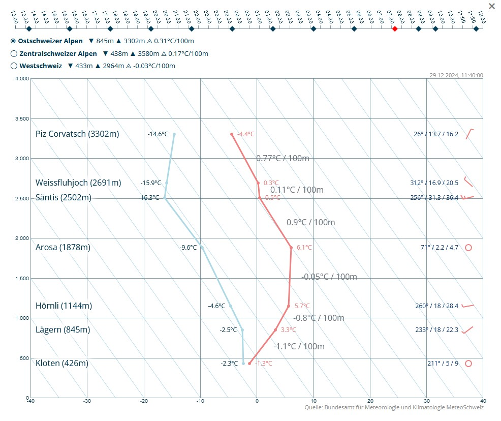
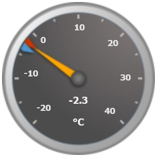

# Meteo UI for https://flugplatz-schaenis.ch

## Emagram
This subcomponent contains all content for the emagram on the website:

## Weatherstation Live Gauges
This subcomponent contains all content for the live weather gauges. It fetches the current and historic data from the Davis Weatherlink Cloud and outputs it to a textfile readable by the gauges.
